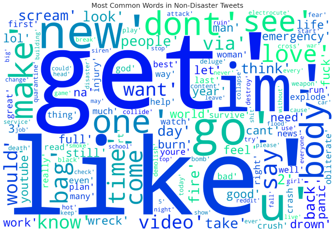
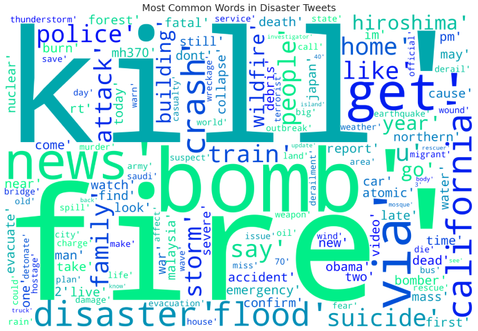

# Disaster tweets classifier

</img></img>

## About

Predict which Tweets are about real disasters and which ones are not with BERT, Transformers and Pytorch  
https://www.kaggle.com/competitions/nlp-getting-started/overview

## Score

`0.83941`

## Contributing

Your contribution is always welcome. Please read [Contributing Guide](.github/CONTRIBUTING.md).

## References

[Disaster Tweets NLP: EDA & BERT With Transformers - Ertuğrul Demir](https://www.kaggle.com/code/datafan07/disaster-tweets-nlp-eda-bert-with-transformers/notebook)
